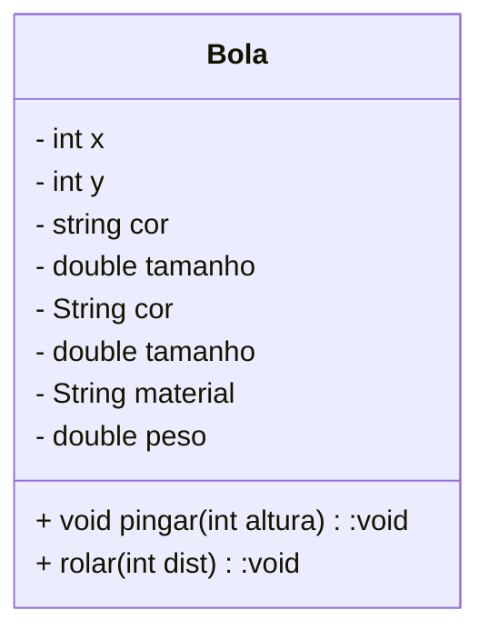
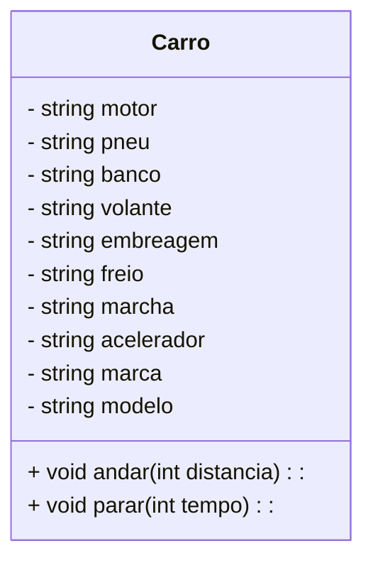
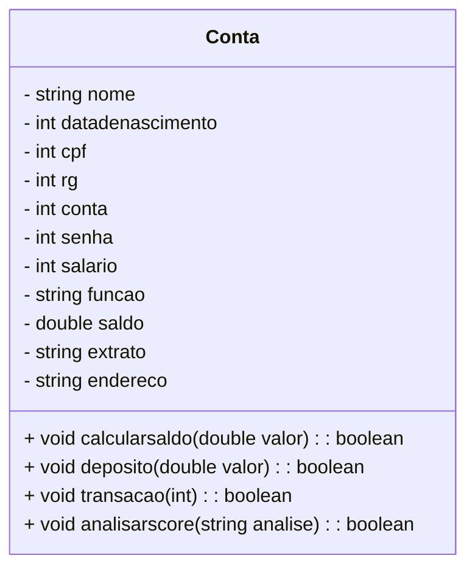
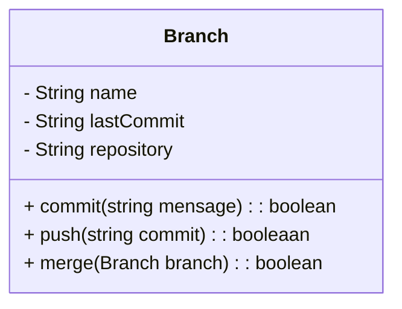

1. Modelar uma classe para representar uma bola.

2. Modelar uma classe para representar um carro.

3. Modelar uma classe para uma conta bancária 

4. Modelar uma classe para representar uma Branch

